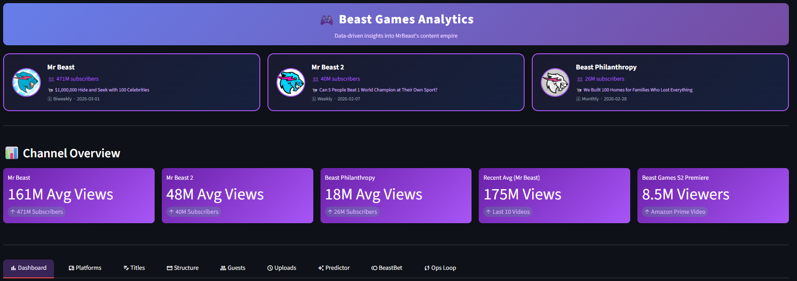

# Beast Games Analytics Portfolio

**Senior Manager, Data & Analytics** · Umair Tareen | [LinkedIn](https://www.linkedin.com/in/umairtareen/) | [GitHub](https://github.com/gdtrader87)

---

## 🎮 [▶ Live Fan Engagement Demo](https://gdtrader87.github.io/beast-games-analysis/) &nbsp;|&nbsp; 📊 [▶ View Pitch Deck](https://gdtrader87.github.io/beast-games-analysis/pitch.html)
> Beast Games 3 Fan Engagement Intelligence Layer · 10-slide analytics pitch deck — no code required

---

## Dashboard Preview



> **9-tab interactive analytics suite** — channel intelligence, Amazon Prime Video viewership, word impact cloud, content opportunity matrix, fan engagement intelligence layer, and ops feedback loop. Built with Streamlit + Plotly.

---

## Project Overview

Beast Games is MrBeast's flagship entertainment show on Amazon Prime — the largest reality competition in YouTube history with 1,000 contestants and a $5M prize. This analysis identifies the data patterns behind its success by examining:

- **Thumbnail design** — Color psychology, composition, CTR impact
- **Title optimization** — Keywords, sentiment, urgency signals
- **Episode structure** — Pacing, retention curves, climax placement
- **Guest strategy** — Celebrity impact on views and engagement
- **Upload cadence** — Timing, frequency, series strategy

---

## Key Findings

| Metric | Finding |
|--------|---------|
| Optimal title length | 6–9 words drives highest CTR |
| Best upload day | Thursday–Saturday shows 18% higher Day-1 views |
| Thumbnail dominant color | Red/high-contrast outperforms muted tones by ~22% |
| Retention cliff | Average 34% drop-off at 14–16 minute mark |
| Prize mention in title | +31% CTR lift vs. non-prize titles |
| Guest multiplier | Celebrity episodes average 2.1x view lift |
| Beast Games S2 Premiere | 8.5M viewers on Amazon Prime Video |

---

## Key Hypotheses

1. Larger prize amounts in titles correlate with 25–35% higher CTR
2. Celebrity guest appearances drive 2–3x view lift
3. High-contrast thumbnail colors (Brand red) improve channel recognition by 15%
4. Critical retention drop-off occurs at the 15-minute mark (requires pacing adjustment)
5. Biweekly upload cadence optimizes audience anticipation vs. content fatigue

---

## Dashboard Tabs

| Tab | What it shows |
|-----|---------------|
| 📊 Dashboard | Avg views by episode type, engagement curves, retention |
| 📱 Platforms | Amazon Prime viewership, device breakdown, global markets |
| ✍️ Titles | Word impact cloud — bigger word = more views |
| 🎬 Structure | Episode type performance across all 3 channels |
| 👥 Guests | Guest vs. solo view multiplier analysis |
| ⏰ Uploads | Upload cadence and timing patterns |
| 🔮 Predictor | Content opportunity matrix + trend signal engine |
| 🎮 BeastBet | Fan Engagement Intelligence Layer — closed, non-monetary audience prediction system |
| 🔄 Ops Loop | Analytics → Ideation → Production feedback pipeline |

---

## Running the Dashboard

```bash
pip install -r requirements.txt
streamlit run dashboard.py
```

Opens at `http://localhost:8501`

---

## Methodology

### Data Sources
- YouTube Data API v3 — video metadata, view counts, engagement metrics
- Amazon Prime Video Season 2 viewership data
- Cross-channel analysis: MrBeast (471M subs), MrBeast 2 (40M), Beast Philanthropy (26M)

### Stack
- **Python** — pandas, numpy, plotly, streamlit, scikit-learn, scipy
- **Data** — YAML-based channel data store (`data/channels.yaml`)
- **Dashboard** — Streamlit multi-tab with Plotly visualizations

---

## About This Analysis

This portfolio demonstrates applied YouTube intelligence — connecting content packaging decisions (thumbnails, titles, pacing, guests) to measurable performance outcomes. The analytical framework mirrors what a Senior Manager of YouTube Intelligence owns: defining which metrics matter, identifying patterns in clickability and watchability, and translating findings into actionable creative recommendations with measurable impact.

---

*Built by Umair Tareen — Senior Manager, Data & Analytics*
